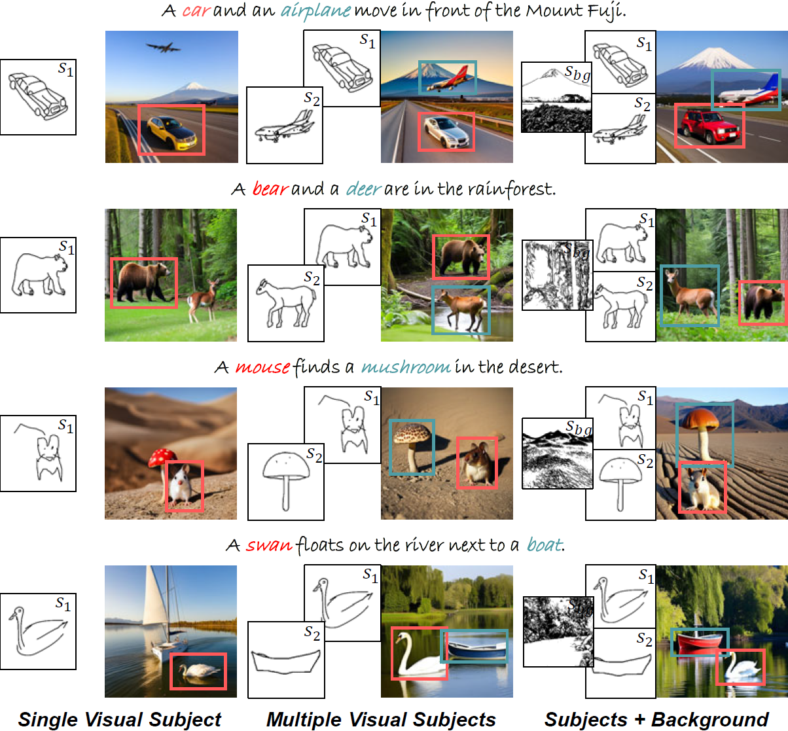

# Versagen (AAAI 2025)

This is the official implementation of "VersaGen: Unleashing Versatile Visual Control for Text-to-Image Synthesis".

  

# ToDo
___
- [ ] Release the inference code.
- [ ] Release the data processing code.
- [ ] Release the training code.

